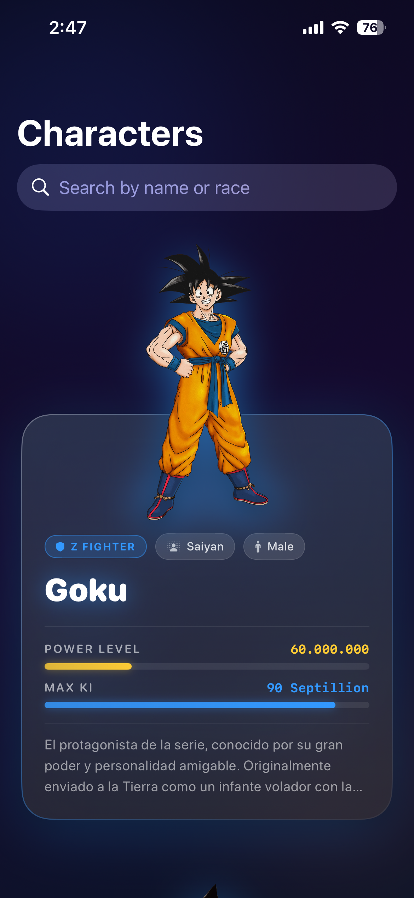
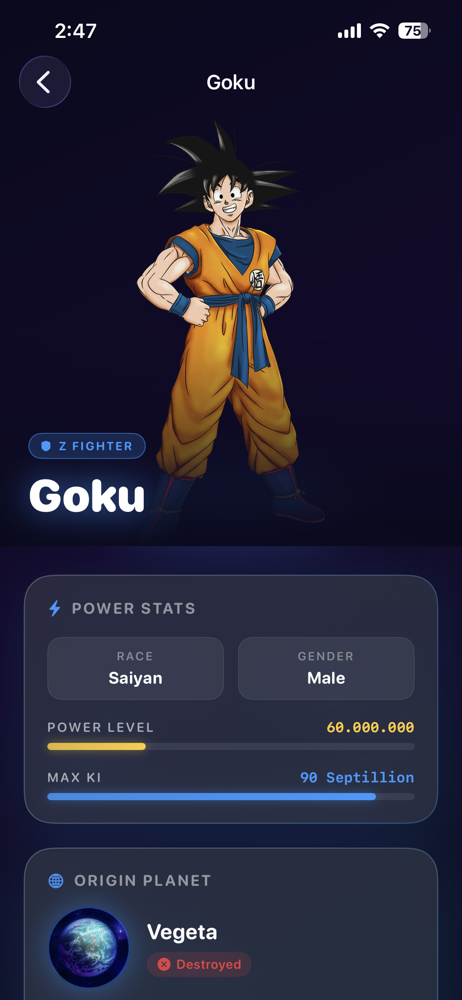
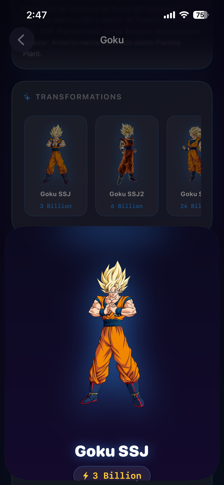

# Dragon Ball App

A SwiftUI showcase app that brings the Dragon Ball universe to life — featuring a paginated character roster and rich detail screens, built with a clean production-grade architecture.

---

## Demo

<!--
  To embed the video:
  1. Go to your GitHub repo → open any Issue or PR
  2. Drag demo.mp4 from the Demo/ folder into the comment box
  3. GitHub will upload it and give you a URL like:
     https://github.com/user-attachments/assets/xxxxxxxx-xxxx-xxxx-xxxx-xxxxxxxxxxxx
  4. Paste that URL below and delete this comment block
-->

https://github.com/user-attachments/assets/PASTE-YOUR-ASSET-URL-HERE

> Can't see the video? Download it directly: [`Demo/demo.mp4`](Demo/demo.mp4)

---

## Screenshots

| Character List | Character Detail | Transformation Sheet |
|---|---|---|
|  |  |  |

---

## Features

- **Animated splash screen** — Dragon Ball sphere with pulsing aura, crossfades into the app
- **Paginated character list** — lazy-loads all 58+ Dragon Ball characters with infinite scroll
- **Search & filter** — search by name or race across all loaded characters
- **Poster-style cards** — character art floats above a glassmorphic info panel with affiliation aura theming
- **Character detail screen** — full biography, power stats, origin planet, and transformation gallery
- **Transformation sheet** — tap any transformation card to open a full-screen sheet with large art and Ki value
- **Animated Ki bars** — log-scale spring-animated power level indicators that are meaningful across the full power range (Mr Satan → Zeno)
- **Image caching** — 50 MB memory + 200 MB disk cache via `URLCache`, zero re-downloads on scroll
- **Haptic feedback** — light impact on every card press
- **Pull-to-refresh** — reloads the character list from page 1
- **Error handling** — typed network errors with retry UI on every screen

---

## Architecture

```
DragonBall/
├── App/
│   ├── DragonBallApp.swift        Entry point
│   └── ContentView.swift          Splash → NavigationStack transition
│
├── Core/
│   ├── Components/
│   │   └── CachedAsyncImage.swift  Drop-in AsyncImage with URLCache
│   └── Network/
│       ├── APIClient.swift         Generic URLSession async/await wrapper
│       ├── APIEndpoint.swift       Typed route definitions
│       └── NetworkError.swift      Typed error model
│
├── Features/
│   ├── Splash/
│   │   └── SplashScreenView.swift
│   ├── CharacterList/
│   │   ├── CharacterListView.swift
│   │   ├── CharacterListViewModel.swift
│   │   ├── CharacterModel.swift
│   │   └── Components/
│   │       └── CharacterItemCardView.swift
│   └── CharacterDetails/
│       ├── CharacterDetailsView.swift
│       └── CharacterDetailsViewModel.swift
│
└── Resources/
    └── Assets.xcassets
```

### Key design decisions

| Decision | Approach |
|---|---|
| State management | `@Observable` + `@MainActor` (Swift 5.9+, no Combine) |
| Networking | Generic `async/await` `URLSession` — no third-party libraries |
| Navigation | `NavigationStack` + `NavigationLink` |
| Pagination | Index-based early trigger (fires 3 items before end of list) |
| Image caching | Shared `URLCache` (50 MB memory / 200 MB disk) via `CachedAsyncImage` |
| Ki bar scale | Log₁₀ normalisation — meaningful bars from 450 (Mr Satan) to 10¹⁰⁰ (Zeno) |
| Decoding resilience | Custom `init(from:)` on enums — unknown API values fall back gracefully |

---

## Tech Stack

- **Language:** Swift 5.9
- **UI Framework:** SwiftUI
- **Minimum Target:** iOS 17
- **Networking:** URLSession (`async/await`)
- **Dependencies:** None — zero third-party libraries

---

## API

Data is sourced from the open [Dragon Ball API](https://dragonball-api.com).

| Endpoint | Usage |
|---|---|
| `GET /api/characters?page=1&limit=10` | Paginated character list |
| `GET /api/characters/:id` | Full character detail (includes planet + transformations) |

---

## Getting Started

1. Clone the repo
   ```bash
   git clone https://github.com/YOUR_USERNAME/DragonBall.git
   ```
2. Open `DragonBall.xcodeproj` in Xcode 15+
3. Select a simulator or device
4. Press `Cmd+R` to build and run

No API keys or additional setup required.

---

## Author

**Shihab Hossain**
Built as a portfolio project to demonstrate SwiftUI architecture, async networking, and UI design.
